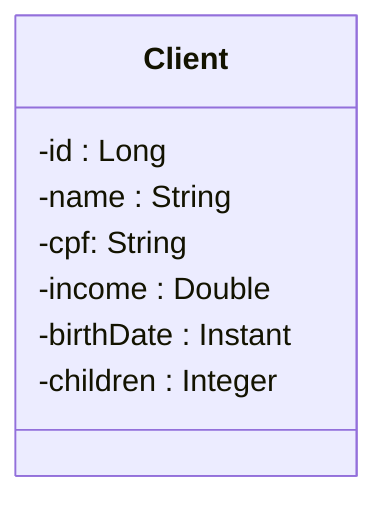

<h1>Primeiro Desafio do bootcamp dev superior</h1>

<h2>Desafio do capítulo 1: Backend parte 1</h2>

Trabalho final do capítulo
Enunciado do trabalho
Você deverá entregar um projeto Spring Boot 2.3.x contendo um CRUD completo de web
services REST para acessar um recurso de clientes, contendo as cinco operações básicas
aprendidas no capítulo:

<ul>
  <li>Busca paginada de recursos</li>
  <li>Busca de recurso por id</li>
  <li>Inserir novo recurso</li>
  <li>Atualizar recurso</li>
  <li>Deletar recurso</li>
</ul>

O projeto deverá estar com um ambiente de testes configurado acessando o banco de dados
H2, deverá usar Maven como gerenciador de dependência, Java 11 como l inguagem.
Um cliente possui nome, CPF, renda, data de nascimento, e quantidade de filhos. A
especificação da entidade Client é mostrada a seguir:

